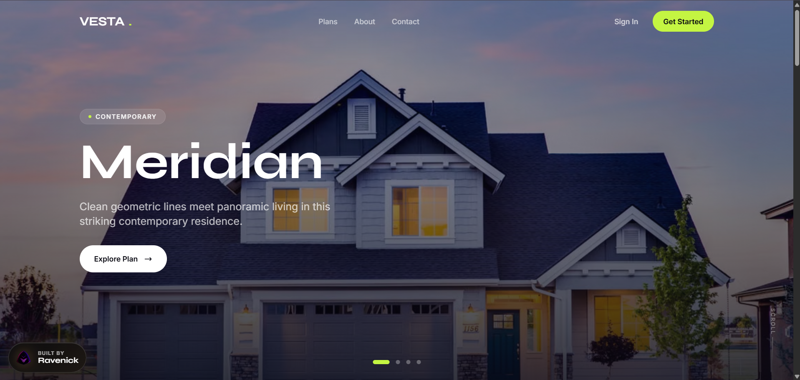
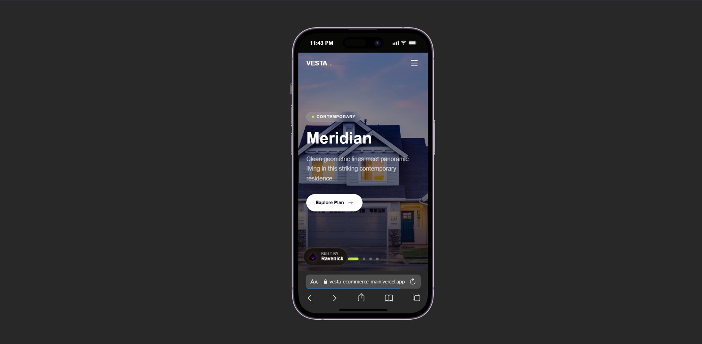

# Vesta House Plans

A premium, OC-themed architecture storefront for browsing and purchasing modern house plans. The interface demonstrates immersive image-led hero slides, structured plan collections, modal-driven plan exploration, and polished purchase flows within a refined dark editorial aesthetic.

> [!NOTE]
> [Live demo](https://vesta-ecommerce-main.vercel.app/)

## Preview





## Features

- Auto-rotating full-screen hero gallery with clickable featured house plans
- Curated plan catalog with bedrooms, bathrooms, square footage, pricing, and architectural style metadata
- Modal-based plan detail workflow for focused browsing without leaving the main page
- Purchase flow simulation with plan type selection, checkout handling, and success confirmation states
- Continuous ticker strip for showcasing the full Vesta plan collection
- About and contact sections structured for architecture service positioning and lead capture
- Fixed Ravenick portfolio badge with logo lockup and sheen animation
- Portfolio-ready SEO metadata authored for Nelson Emmanuel | Ravenick

## Built With

| Tool           | Use                                                  |
| -------------- | ---------------------------------------------------- |
| React 18       | Component-driven storefront and modal state handling  |
| TypeScript     | Typed plan data, purchase flows, and component props  |
| Tailwind CSS 3 | Responsive layouts, dark interface styling, and motion |
| Vite 6         | Production compilation and development runtime        |

## Project Structure
```text
src/
  components/
    About.tsx
    Contact.tsx
    Footer.tsx
    Hero.tsx
    InfoModal.tsx
    Navbar.tsx
    PlanCard.tsx
    PlanDetailModal.tsx
    PlansSection.tsx
    PurchaseModal.tsx
    RavenickBadge.tsx
    SuccessModal.tsx
    Ticker.tsx
  App.tsx
  data.ts
  index.css
  main.tsx
  types.ts
public/
  oc-logo-no-bg.png
```

## Run Locally
```bash
git clone https://github.com/Ravenick/vesta-ecommerce-website.git
cd "vesta-ecommerce-website"
npm install
npm run dev
```

Create a production build with:
```bash
npm run build
```

## Author

Nelson Emmanuel | Raven
